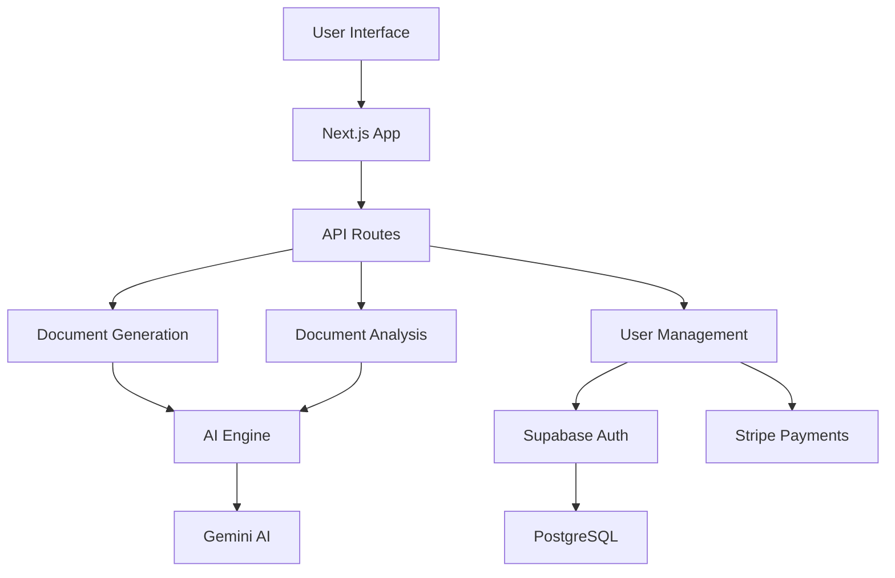

# Architecture Overview

## High-Level Architecture

## Component Interactions

### Frontend
- Next.js App
- React Components
- Tailwind CSS for styling
- shadcn/ui for UI components

### Backend
- API Routes for:
  - Document generation
  - Document analysis
  - User management
  - Payment processing

### Services
- Supabase for authentication and database
- Stripe for payments
- Gemini AI for document processing

## Data Flow

1. User interacts with UI
2. API routes process requests
3. AI engine generates/analyzes documents
4. Results returned to user
5. User actions logged in database

## Security Considerations

### Authentication
- JWT tokens for session management
- Password hashing
- Secure cookie storage

### Data Protection
- Encryption at rest
- SSL/TLS for data in transit
- Role-based access control

### Payment Security
- PCI DSS compliance
- Tokenized payments
- Webhook signature verification