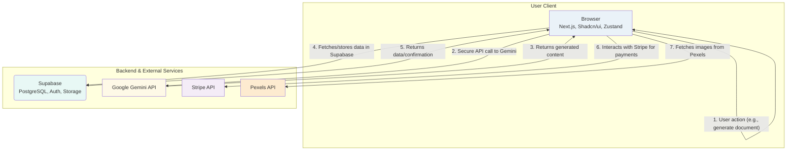

# DocMagic System Architecture

This document provides a detailed technical overview of the DocMagic project. It outlines the system's architecture, core components, data flows, and the engineering rationale behind key technology choices, intended for developers and contributors.

## 1. High-Level Architecture 🏛️

DocMagic operates on a serverless, client-server model. This modern architecture separates the user interface (frontend) from the backend services, which are managed by a third-party Backend-as-a-Service (BaaS) provider. This enhances scalability, simplifies development, and allows for independent evolution of the frontend and backend components.

- **Frontend (Next.js Client):** A modern, interactive web application responsible for all user interactions, rendering the UI, and communicating with the backend and AI services.

- **Backend (Supabase):** A comprehensive BaaS platform that provides the project's database, authentication, and file storage, eliminating the need for a traditional, self-hosted backend server.

- **AI Service (Google Gemini):** A powerful third-party large language model (LLM) that performs the sophisticated task of code analysis and documentation generation.

- **External Services (Pexels, Stripe):** APIs for integrating professional stock photography and managing payments and subscriptions.

### Architectural Diagram

This diagram illustrates the primary request-response lifecycle for generating a document.

## 2. Technology Stack & Rationale 🛠️

The technology stack for DocMagic was carefully selected to prioritize performance, developer experience, and maintainability.

### Frontend

- **Next.js (App Router):** Chosen for its cutting-edge features like React Server Components, Server Actions, and streamlined data fetching, which improve performance and organize the codebase logically. The App Router paradigm is central to the project's structure.

- **Shadcn/ui & Radix UI:** Instead of a rigid component library, Shadcn/ui provides beautifully designed components built on Radix UI's accessible primitives. This offers maximum customization and full ownership over the design system.

- **Tailwind CSS:** A utility-first CSS framework that enables rapid, consistent, and maintainable styling directly within the component markup.

- **Zustand:** A lightweight, hook-based state management library. It was selected over more complex solutions like Redux for its minimal boilerplate and intuitive API, simplifying global state synchronization.

- **Framer Motion:** Used for creating smooth, high-performance animations and micro-interactions throughout the application.

### Backend & Database

- **Supabase:** A comprehensive open-source Firebase alternative that provides a suite of backend services:

  - **PostgreSQL Database:** A robust, object-relational database with real-time capabilities.
  - **Supabase Auth:** Handles user authentication, including social logins and JWT-based session management.
  - **Supabase Storage:** For managing user-generated files and assets.
  - **Row Level Security (RLS):** A key feature for ensuring data privacy and security within the database.

- **Google Generative AI SDK:** The official, optimized SDK for interacting with the Gemini API, simplifying authentication and API calls.

### DevOps & Deployment

- **Netlify/Vercel:** The project is optimized for deployment on modern hosting platforms like Netlify and Vercel. These platforms provide seamless Git integration, automatic builds, and global CDN distribution for optimal performance and scalability.

- **Docker:** While not the primary deployment method, Docker could be used for creating a consistent local development environment, though the README.md emphasizes Netlify/Vercel for production.

## 3. Data & Control Flow 🔁

The process of generating documentation is a well-defined sequence of events:

- **User Interaction:** A user interacts with a client-side component on the Next.js frontend, enters their content, and triggers the generation process.

- **State Management:** The frontend uses a Zustand store to manage the application's state, such as loading and user data.

- **Authentication:** All user-specific actions are authenticated via Supabase Auth. The client-side Supabase library manages JWTs, ensuring secure communication with the database.

- **AI Generation:** For AI-powered features, the frontend makes a direct, secure API call to the Google Gemini API. The API key for the Gemini service is securely stored as an environment variable and accessed on the server-side (e.g., via a Next.js API route or Server Action).

- **Data Persistence:** User data, generated documents, and other application-specific information are stored in the Supabase PostgreSQL database. The frontend interacts with the database using the Supabase client library.

- **Real-time Updates:** The UI is updated in real-time to reflect the generated content and the current state of the application.

## 4. Key Architectural Decisions 🤔

- **Serverless Architecture with Supabase:** This was a strategic choice to reduce backend management overhead, simplify development, and leverage Supabase's robust, scalable infrastructure for authentication, database, and storage.

- **Decoupled Frontend/Backend:** This fundamental choice allows for independent team workflows, technology stacks, and deployment cycles. The frontend can be hosted on a CDN (like Vercel or Netlify), while the backend services are managed by Supabase.

- **Direct Client-to-AI Service Communication:** The architecture favors direct, secure communication from the Next.js frontend (or its server-side components) to the Google Gemini API. This simplifies the data flow and reduces the need for an intermediary backend server.

- **Component-based UI with Shadcn/ui:** This approach strikes a perfect balance between using pre-built components and maintaining full control over the application's look and feel.

## 5. Security Considerations 🔒

- **API Key Management:** All API keys (for Google Gemini, Stripe, Pexels, and Supabase) are stored securely as environment variables and are not exposed on the client-side.

- **Authentication:** User authentication is handled by Supabase Auth, which provides secure JWT-based authentication and session management.

- **Database Security:** The Supabase database is protected by Row Level Security (RLS) policies, ensuring that users can only access and modify their own data.

- **Secure Communication:** All communication between the client, Supabase, and external APIs is encrypted using HTTPS.

## 6. Error Handling and Resilience ⚙️

- **API Errors:** The application includes logic to gracefully handle potential errors from the Google Gemini API and other external services. This includes displaying user-friendly error messages and implementing retry mechanisms where appropriate.

- **Data Validation:** Zod is used for schema validation, ensuring that data sent to and received from APIs and the database is in the correct format.

- **UI Feedback:** The application provides clear feedback to the user in case of errors, such as toast notifications or inline error messages.

## 7. Scalability and Performance 🚀

- **Serverless Scalability:** By leveraging Supabase, the backend can scale automatically to handle a growing number of users and requests without manual intervention.

- **Edge Deployment:** Deploying the Next.js frontend to a platform like Vercel or Netlify allows for content to be served from a global CDN, reducing latency for users around the world.

- **Optimized Frontend:** The use of Next.js with Server Components, code splitting, and image optimization ensures a fast and responsive user experience.
