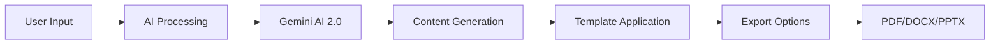

# 🪄 DocMagic - AI Document Creation Platform

<div align="center">

[](https://nextjs.org/)
[](https://reactjs.org/)
[](https://www.typescriptlang.org/)
[](https://tailwindcss.com/)

[](https://supabase.com/)
[](https://ai.google.dev/)
[](https://stripe.com/)
[](https://www.framer.com/motion/)

[](https://opensource.org/licenses/MIT)
[](https://github.com/docmagic-ai/docmagic)
[](https://docmagic1.netlify.app)
[](https://github.com/docmagic-ai/docmagic/releases)
[](http://makeapullrequest.com)
[](./CONTRIBUTING.md)

<br />


### 🚀 **Transform Ideas into Professional Documents with AI Magic**

**DocMagic** is a **100% open source**, cutting-edge AI-powered document creation platform that revolutionizes how professionals create stunning documents. Built by the community, for the community - simply describe what you need, and watch as our advanced AI transforms your ideas into polished resumes, captivating presentations, comprehensive CVs, and professional letters in seconds.

<br />

### 🎯 **50,000+ Documents Created** • 🏆 **99% Success Rate** • ⭐ **4.9/5 User Rating** • 🌍 **50+ Countries**

> *"Create professional documents in seconds with AI magic ✨"*

<br />

[](https://docmagic1.netlify.app)
[](https://docmagic1.netlify.app/about)
[](https://github.com/docmagic-ai/docmagic/fork)
[](./CONTRIBUTING.md)
[](./API.md)

</div>

---

## ✨ Core Features & Capabilities

### 🤖 **AI-Powered Document Generation**
- **🎯 Smart Resume Builder**: Create professional resumes with Gemini AI 2.0 Flash
- **📊 Presentation Generator**: Generate complete slide decks with outlines and themes
- **📄 CV Creator**: Build comprehensive curriculum vitae with intelligent formatting
- **✉️ Letter Composer**: Draft professional letters for any purpose
- **🔍 ATS Resume Analyzer**: Optimize resumes for Applicant Tracking Systems
- **🎨 Template Selection**: Multiple professional templates for each document type

### 🎨 **Modern UI/UX Design**
- **✨ Glass Morphism Interface**: Modern glass-effect components with subtle transparency and blur effects
- **🌈 Gradient Magic**: Dynamic bolt gradients and shimmer effects throughout the interface
- **🎭 Floating Animations**: Smooth floating orbs and animated background elements powered by Framer Motion
- **📱 Responsive Excellence**: Mobile-first design optimized for all screen sizes
- **🌙 Dark/Light Theme**: Seamless theme switching with next-themes
- **♿ Accessibility First**: WCAG 2.1 AA compliant components
- **🎯 Magical Professionalism**: Design philosophy combining cutting-edge visual effects with professional usability
- **Micro-Interactions**: Hover effects, scale transitions, and pulse animations for enhanced user engagement

### 🤖 **AI-Powered Document Generation**
- **Smart Text Processing**: Advanced Gemini AI integration for intelligent content generation
- **Context-Aware Creation**: AI understands industry standards and target audience requirements
- **Multiple Document Types**: 
  - 📄 **Professional Resumes** with ATS optimization
  - 🎯 **Stunning Presentations** with smart layouts and charts
  - 📋 **Comprehensive CVs** for academic and research positions
  - ✉️ **Business Letters** with perfect tone and formatting

### 🛠️ **Professional Tools & Features**
- **ATS Analyzer**: Real-time resume scanning for Applicant Tracking System compatibility
- **Template Library**: Curated collection of professional, modern templates
- **Smart Editing**: Intuitive WYSIWYG editor with real-time preview
- **Multi-Format Export**: Download as PDF, DOCX, or PPTX with one click
- **Chart Integration**: Automatic data visualization for presentations using Recharts
- **📄 Comprehensive About Page**: Detailed information about features, technology, security, and roadmap accessible at `/about`
- **🧭 Intuitive Navigation**: Clean header with easy access to Resume, Presentation, Letter tools, and About page
- **Image Integration**: Professional stock photos from Pexels API

## 🛠️ Tech Stack & Architecture

### 🎨 **Frontend Excellence**
- **Next.js 15** - Latest React framework with App Router and Server Components
- **TypeScript 5.2** - Full type safety and enhanced developer experience
- **Tailwind CSS 3.3** - Utility-first styling with custom animations and gradients
- **Radix UI** - Accessible, unstyled component primitives for maximum customization
- **Framer Motion 12** - Smooth animations and micro-interactions
- **Lucide React** - 1000+ beautiful, customizable SVG icons
- **React Hook Form** - Performant forms with validation
- **Zustand** - Lightweight state management

### 🔧 **Advanced Component System**
- **🎨 Radix UI Foundation**: 25+ accessible components including dialogs, dropdowns, and forms
- **📝 Form Management**: React Hook Form with Zod validation for type-safe forms
- **📊 Data Visualization**: Recharts integration for analytics and progress tracking
- **🎪 Interactive Elements**: Carousels, accordions, and collapsible content
- **🎯 Smart Inputs**: OTP inputs, date pickers, and file upload with drag-and-drop
- **🔔 Toast Notifications**: Sonner-powered notifications for user feedback

### 🔐 **Authentication & Security**
- **🛡️ Supabase Auth**: Secure user authentication with JWT tokens
- **👤 User Management**: Registration, login, password reset, and profile management
- **🔒 Protected Routes**: Client-side route protection and redirects
- **📊 Session Management**: Persistent sessions with automatic token refresh
- **🔐 Environment Security**: Secure API key management and environment variables

### 💳 **Payment & Subscription System**
- **💰 Stripe Integration**: Secure payment processing with Stripe
- **📋 Subscription Management**: Pro/Free tier management with usage limits
- **🏪 Customer Portal**: Self-service billing and subscription management
- **📊 Usage Tracking**: Monitor document generation limits and analytics
- **🔔 Webhook Handling**: Real-time payment and subscription status updates
- **Glass Morphism Design**: Custom CSS with backdrop-blur and transparency effects
- **Responsive Grid System**: Mobile-first approach with breakpoint optimization
- **Custom Animations**: Floating orbs, shimmer effects, and gradient transitions
- **Accessibility First**: ARIA compliance and keyboard navigation support
- **Theme System**: Dark/light mode with system preference detection

### 🗄️ **Backend & Database**
- **Supabase** - PostgreSQL with real-time subscriptions and Row Level Security
- **Supabase Auth** - OAuth providers, magic links, and secure session management
- **Database Migrations** - Version-controlled schema changes
- **Real-time Updates** - Live collaboration features

### 🤖 **AI & External Services**
- **Google Gemini AI** - Advanced language model for intelligent content generation
- **Pexels API** - Professional stock photography integration
- **Document Parsers** - PDF, DOCX parsing with Mammoth.js and pdf-parse
- **Export Libraries** - jsPDF, docx, and pptxgenjs for multi-format downloads

### 💳 **Payments & Subscriptions**
- **Stripe Integration** - Secure payment processing with webhooks
- **Subscription Management** - Tiered pricing with usage tracking
- **Customer Portal** - Self-service billing and subscription management

### 🚀 **Deployment & Performance**
- **Netlify** - Edge deployment with automatic builds and previews
- **Vercel Ready** - Alternative deployment configuration included
- **Performance Optimized** - Image optimization, code splitting, and caching strategies

## 🎨 UI/UX Design Philosophy

### ✨ **Modern Glass Morphism Interface**
DocMagic features a cutting-edge design system built around glass morphism principles, creating a sophisticated and intuitive user experience:

- **Glass Effects**: Subtle transparency and backdrop-blur effects throughout the interface
- **Dynamic Gradients**: Custom "bolt gradients" that create visual depth and energy
- **Floating Elements**: Animated orbs and particles that respond to user interactions
- **Shimmer Animations**: Subtle shine effects that guide user attention
- **Responsive Typography**: Fluid text scaling that adapts to all screen sizes

### 🎯 **User Experience Highlights**

#### 📱 **Mobile-First Responsive Design**
- Optimized touch targets for mobile devices
- Swipe gestures and touch-friendly interactions
- Progressive enhancement for larger screens
- Consistent experience across all devices

#### 🌓 **Intelligent Theme System**
- Automatic dark/light mode detection based on system preferences
- Smooth theme transitions with preserved user state
- High contrast ratios for accessibility compliance
- Custom color schemes for different document types

#### ⚡ **Performance-Optimized Interactions**
- 60fps animations using hardware acceleration
- Lazy loading for optimal page speed
- Debounced search and form inputs
- Optimistic UI updates for instant feedback

## 📸 Platform Screenshots

<div align="center">

### 🏠 **Landing Page with Glass Morphism Design**

<p><em>Hero section with floating animations and gradient effects</em></p>

### 📄 **AI Resume Generator Interface**

<p><em>Intelligent resume builder with real-time ATS optimization</em></p>

### 🎯 **Presentation Studio with Smart Layouts**

<p><em>Professional slide creator with automatic chart generation</em></p>

## 🏗️ **Technical Architecture**

### 🚀 **Frontend Stack**
```typescript
// Core Framework
Next.js 15.4.0          // React framework with App Router
React 18.3.1            // UI library with concurrent features
TypeScript 5.8.3        // Type-safe development

// Styling & UI
Tailwind CSS 3.4.17     // Utility-first CSS framework
Radix UI                // Accessible component primitives
Framer Motion 12.23.6   // Animation library
next-themes 0.4.6       // Theme management

// Forms & Validation
React Hook Form 7.60.0  // Performant forms
Zod 3.25.76            // Schema validation
```

### 🔧 **Backend & Services**
```typescript
// Database & Auth
Supabase                // PostgreSQL database + Auth
@supabase/auth-helpers-nextjs 0.10.0
@supabase/supabase-js 2.52.0

// AI & Generation
Google Gemini AI        // Document generation
@google/generative-ai 0.3.1 // Official Gemini SDK

// Payments
Stripe 14.25.0          // Payment processing
@stripe/stripe-js 3.5.0 // Client-side Stripe

// Document Processing
mammoth 1.9.1           // DOCX parsing
pdf-parse 1.1.1         // PDF parsing
docx 8.5.0              // DOCX generation
jspdf 2.5.2             // PDF generation
pptxgenjs 3.12.0        // PowerPoint generation
```

### 📊 **Document Processing Pipeline**


### 🔍 **ATS Analyzer System**

<p><em>Real-time resume analysis with actionable insights</em></p>

</div>

## 📁 Project Structure

```
docmagic/
├── app/                      # Next.js app directory
│   ├── api/                  # API routes
│   │   ├── analyze/          # Resume analysis endpoints
│   │   ├── auth/             # Authentication endpoints
│   │   ├── generate/         # Document generation endpoints
│   │   ├── send-email/       # Email sending functionality
│   │   ├── stripe/           # Stripe payment integration
│   │   └── user/             # User data endpoints
│   ├── auth/                 # Authentication pages
│   ├── cv/                   # CV generator page
│   ├── letter/               # Letter generator page
│   ├── presentation/         # Presentation generator page
│   ├── resume/               # Resume generator pages
│   ├── settings/             # User settings page
│   ├── globals.css           # Global styles
│   ├── layout.tsx            # Root layout component
│   └── page.tsx              # Home page
├── components/               # React components
│   ├── auth-provider.tsx     # Authentication context provider
│   ├── document-card.tsx     # Document type card component
│   ├── features-section.tsx  # Features showcase section
│   ├── hero-section.tsx      # Landing page hero section
│   ├── letter/               # Letter-specific components
│   ├── presentation/         # Presentation-specific components
│   ├── resume/               # Resume-specific components
│   ├── site-header.tsx       # Navigation header
│   ├── sponsor-banner.tsx    # Sponsor information banner
│   ├── subscription-button.tsx # Subscription management
│   ├── testimonials-section.tsx # User testimonials
│   ├── theme-provider.tsx    # Dark/light theme provider
│   ├── theme-toggle.tsx      # Theme toggle button
│   └── ui/                   # UI components (shadcn/ui)
├── hooks/                    # Custom React hooks
│   ├── use-subscription.ts   # Subscription state management
│   └── use-toast.ts          # Toast notifications
├── lib/                      # Utility libraries
│   ├── gemini.ts             # Google Gemini AI integration
│   ├── parsers/              # Document parsing utilities
│   ├── stripe.ts             # Stripe payment configuration
│   ├── supabase/             # Supabase client configuration
│   └── utils.ts              # General utility functions
├── public/                   # Static assets
├── supabase/                 # Supabase configuration
│   └── migrations/           # Database migration files
├── types/                    # TypeScript type definitions
│   └── supabase.ts           # Supabase database types
├── .env.local                # Environment variables (not in repo)
├── .eslintrc.json            # ESLint configuration
├── .gitignore                # Git ignore file
├── CONTRIBUTING.md           # Contribution guidelines
├── LICENSE                   # MIT license
├── README.md                 # Project documentation
├── middleware.ts             # Next.js middleware
├── netlify.toml              # Netlify deployment configuration
├── next.config.js            # Next.js configuration
├── package.json              # Project dependencies
├── postcss.config.js         # PostCSS configuration
├── tailwind.config.ts        # Tailwind CSS configuration
└── tsconfig.json             # TypeScript configuration
```


## 🚀 **Quick Start Guide**

### 🌐 **Learn More**

Visit our comprehensive **About Page** at [https://docmagic1.netlify.app/about](https://docmagic1.netlify.app/about) to explore:
- 🎯 **Mission & Vision** - Our commitment to democratizing document creation
- ⚡ **Core Features** - AI-powered tools and capabilities
- 🛠️ **Technology Stack** - Modern tech powering DocMagic
- 🎨 **Design Philosophy** - "Magical Professionalism" approach
- 🔒 **Security & Quality** - Enterprise-grade security measures
- 🗺️ **Product Roadmap** - Exciting features coming in 2025-2026
- 👥 **Community** - Join our open source community

### 📋 **Prerequisites**

Before you begin, ensure you have the following installed:

```bash
Node.js >= 18.0.0       # JavaScript runtime
npm >= 9.0.0            # Package manager
Git                     # Version control
```

### ⚡ **One-Click Setup**

```bash
# Clone the repository
git clone https://github.com/yourusername/docmagic.git
cd docmagic

# Install dependencies
npm install

# Set up environment variables
cp .env.example .env.local
# Edit .env.local with your API keys

# Run development server
npm run dev
```

🎉 **That's it!** Open [http://localhost:3000](http://localhost:3000) to see DocMagic in action.

### 🔧 **Environment Configuration**

Create a `.env.local` file in the root directory:

```bash
# Supabase Configuration
NEXT_PUBLIC_SUPABASE_URL=your_supabase_url
NEXT_PUBLIC_SUPABASE_ANON_KEY=your_supabase_anon_key
SUPABASE_SERVICE_ROLE_KEY=your_service_role_key

# Google Gemini AI
GEMINI_API_KEY=your_gemini_api_key

# Stripe Configuration
STRIPE_SECRET_KEY=your_stripe_secret_key
NEXT_PUBLIC_STRIPE_PUBLISHABLE_KEY=your_stripe_publishable_key
STRIPE_WEBHOOK_SECRET=your_webhook_secret

# Application URL
NEXT_PUBLIC_APP_URL=http://localhost:3000
```

### 🗄️ **Database Setup**

1. **Create Supabase Project**:
   ```bash
   # Visit https://supabase.com/dashboard
   # Create new project
   # Copy your project URL and anon key
   ```

2. **Run Migrations**:
   ```sql
   -- The migrations are in /supabase/migrations/
   -- They will be automatically applied when you set up Supabase
   ```

3. **Set up Authentication**:
   ```bash
   # Enable Email/Password auth in Supabase dashboard
   # Configure email templates (optional)
   # Set up OAuth providers (optional)
   ```

### 🤖 **AI Service Setup**

1. **Get Gemini API Key**:
   ```bash
   # Visit https://ai.google.dev/
   # Create API key
   # Add to GEMINI_API_KEY in .env.local
   ```

2. **Configure AI Models**:
   ```typescript
   // lib/gemini.ts already configured with:
   // - gemini-2.0-flash for fast generation
   // - Error handling and retries
   // - JSON parsing and validation
   ```

### 💳 **Payment Setup (Optional)**

1. **Stripe Configuration**:
   ```bash
   # Visit https://dashboard.stripe.com/
   # Get your API keys
   # Set up webhook endpoint: /api/stripe/webhook
   ```

2. **Webhook Events**:
   ```typescript
   // Configure these events in Stripe dashboard:
   customer.subscription.created
   customer.subscription.updated
   customer.subscription.deleted
   invoice.payment_succeeded
   invoice.payment_failed
   ```

## 🛠️ **Development Commands**

```bash
# Development
npm run dev          # Start development server
npm run build        # Build for production
npm run start        # Start production server
npm run lint         # Run ESLint
npm run type-check   # Run TypeScript checks

# Database
npx supabase start   # Start local Supabase
npx supabase stop    # Stop local Supabase
npx supabase reset   # Reset local database

# Deployment
npm run deploy       # Deploy to Netlify
vercel --prod        # Deploy to Vercel
```

## 📁 **Project Structure**

```
docmagic/
├── 📁 app/                    # Next.js App Router
│   ├── 📁 api/               # API routes
│   │   ├── 📁 generate/      # AI generation endpoints
│   │   ├── 📁 stripe/        # Payment webhooks
│   │   └── 📁 auth/          # Authentication
│   ├── 📁 resume/            # Resume pages
│   ├── 📁 presentation/      # Presentation pages
│   ├── 📁 letter/            # Letter pages
│   └── 📁 cv/                # CV pages
├── 📁 components/            # React components
│   ├── 📁 ui/                # Radix UI components
│   ├── 📁 resume/            # Resume-specific components
│   ├── 📁 presentation/      # Presentation components
│   └── 📁 letter/            # Letter components
├── 📁 lib/                   # Utility libraries
│   ├── 📄 gemini.ts          # AI integration
│   ├── 📄 stripe.ts          # Payment processing
│   ├── 📄 supabase.ts        # Database client
│   └── 📁 parsers/           # Document parsers
├── 📁 hooks/                 # Custom React hooks
├── 📁 types/                 # TypeScript definitions
├── 📁 supabase/              # Database migrations
└── 📁 public/                # Static assets
```

## 🔗 **API Documentation**

### 🤖 **AI Generation Endpoints**

#### Generate Resume
```typescript
POST /api/generate/resume
Content-Type: application/json

{
  "prompt": "Software engineer with 5 years React experience",
  "name": "John Doe",
  "email": "john@example.com",
  "phone": "+1234567890",
  "location": "San Francisco, CA"
}
```

#### Generate Presentation
```typescript
POST /api/generate/presentation
Content-Type: application/json

{
  "prompt": "Marketing strategy for Q1 2025",
  "pageCount": 10,
  "template": "modern-business"
}
```

#### ATS Resume Analysis
```typescript
POST /api/analyze/resume
Content-Type: multipart/form-data

{
  "file": File,
  "jobDescription": "Job requirements text"
}
```

### 💳 **Payment Endpoints**

#### Create Checkout Session
```typescript
POST /api/stripe/create-checkout
Content-Type: application/json

{
  "priceId": "price_xxx",
  "successUrl": "https://app.com/success",
  "cancelUrl": "https://app.com/cancel"
}
```

For complete API documentation, see [API.md](./API.md).

## 🚀 **Deployment**

### 🌐 **Netlify (Recommended)**

DocMagic is optimized for Netlify deployment:

```bash
# Automatic deployment
git push origin main

# Manual deployment
npm run build
netlify deploy --prod --dir=.next
```

**Configuration**: The `netlify.toml` file is pre-configured with:
- Next.js plugin
- API route handling
- CORS headers
- Environment variables

### ⚡ **Vercel**

Alternative deployment to Vercel:

```bash
# Install Vercel CLI
npm i -g vercel

# Deploy
vercel --prod
```

### 🐳 **Docker**

```dockerfile
# Dockerfile included for containerized deployment
FROM node:18-alpine
WORKDIR /app
COPY package*.json ./
RUN npm ci --only=production
COPY . .
RUN npm run build
EXPOSE 3000
CMD ["npm", "start"]
```

## 🧪 **Testing**

```bash
# Unit tests
npm run test

# E2E tests
npm run test:e2e

# Coverage report
npm run test:coverage
```

For detailed testing guidelines, see [TESTING.md](./TESTING.md).

### Prerequisites

Ensure you have the following installed:
- **Node.js**: Version 18 or higher (includes npm). Download from [nodejs.org](https://nodejs.org/).
- **Git**: For cloning the repository. Install from [git-scm.com](https://git-scm.com/).
- A **Supabase** account for database and authentication. Sign up at [supabase.com](https://supabase.com/).
- A **Google Gemini API key** for AI-powered document generation. Obtain from [Google AI Studio](https://ai.google.dev/).
- A **Stripe account** for payment processing (optional for local testing without payments). Sign up at [stripe.com](https://stripe.com/).

### Installation

1. **Clone the Repository**:
   Clone the project to your local machine and navigate to the project directory:
   ```bash
   git clone https://github.com/yourusername/docmagic.git
   cd docmagic
   ```

2. Install dependencies:
   ```bash
   npm install
   ```
3. Set Up Supabase:
- Log in to your Supabase dashboard and create a new project.
- In the Supabase project, go to Settings > API to find your NEXT_PUBLIC_SUPABASE_URL and NEXT_PUBLIC_SUPABASE_ANON_KEY.
- Go to SQL Editor and run the SQL migrations found in the supabase/migrations/ directory to set up the database schema (Users, Subscriptions, Documents tables).
- Enable Supabase Auth in the Supabase dashboard under Authentication > Settings and configure email authentication.

4. Obtain Google Gemini API Key:
- Visit Google AI Studio and create an API key for Gemini 2.0 Flash.
-  Save the key as GEMINI_API_KEY for use in the environment variables.

5. Set up environment variables:
   Create a `.env.local` file with:
   ```
   NEXT_PUBLIC_SUPABASE_URL=your_supabase_url
   NEXT_PUBLIC_SUPABASE_ANON_KEY=your_supabase_anon_key
   GEMINI_API_KEY=your_gemini_api_key
   STRIPE_SECRET_KEY=your_stripe_secret_key
   STRIPE_WEBHOOK_SECRET=your_stripe_webhook_secret
   STRIPE_PRICE_ID=your_stripe_price_id
   NEXT_PUBLIC_APP_URL=http://localhost:3000
   ```

6. Run Database Migrations:
   If you haven’t already applied migrations via the Supabase dashboard, you can use the Supabase CLI:

   ```bash
   npm install -g supabase
   supabase init
   supabase login
   supabase db push
   ```
7. Run the development server:
   ```bash
   npm run dev
   ```

8. Open [http://localhost:3000](http://localhost:3000) in your browser.

## 🌐 Deployment

The application is deployed on Netlify. To deploy your own instance:

1. Push your code to GitHub
2. Connect your repository to Netlify
3. Configure the build settings:
   - Build command: `npm run build`
   - Publish directory: `.next`
4. Add your environment variables in the Netlify dashboard

## 📝 API Routes Documentation

### Document Generation

| Endpoint | Method | Description | Request Body | Response |
|----------|--------|-------------|--------------|----------|
| `/api/generate/resume` | POST | Generate a resume | `{ prompt, name, email }` | Resume JSON |
| `/api/generate/guided-resume` | POST | Generate guided resume | `{ personalInfo, workExperience, ... }` | Resume JSON |
| `/api/generate/presentation` | POST | Generate presentation | `{ prompt, pageCount }` | Slides array |
| `/api/generate/presentation-outline` | POST | Generate outline | `{ prompt, pageCount }` | Outline array |
| `/api/generate/presentation-full` | POST | Generate full presentation | `{ outlines, template, prompt }` | Slides array |
| `/api/generate/letter` | POST | Generate letter | `{ prompt, fromName, toName, letterType, ... }` | Letter JSON |
| `/api/generate/resume-guidance` | POST | Get resume guidance | `{ step, targetRole, existingData }` | Guidance JSON |

### Analysis

| Endpoint | Method | Description | Request Body | Response |
|----------|--------|-------------|--------------|----------|
| `/api/analyze/resume` | POST | Analyze resume for ATS | FormData with `file` and `jobDescription` | Analysis JSON |

## 🤝 **Contributing to Open Source**

**DocMagic is proudly open source!** We believe in the power of community-driven development and welcome contributions from developers, designers, and users worldwide. Whether you're a seasoned developer or just starting your open source journey, there's a place for you in our community!

### 🌟 **Ways to Contribute**

#### 🐛 **Bug Reports & Fixes**
- Report bugs using our [issue template](https://github.com/docmagic-ai/docmagic/issues/new?template=bug_report.md)
- Fix existing bugs and earn contributor recognition
- Help improve stability and user experience

#### ✨ **Feature Development**
- Check our [roadmap](./ROADMAP.md) for planned features
- Propose new features via [GitHub Discussions](https://github.com/docmagic-ai/docmagic/discussions)
- Implement features that benefit the entire community

#### 📚 **Documentation & Community**
- Improve documentation and tutorials
- Help other users in discussions and issues
- Create blog posts, videos, or tutorials about DocMagic
- Translate the interface to new languages

#### 🎨 **Design & UX**
- Contribute to UI/UX improvements
- Design new templates and themes
- Improve accessibility features

### 🚀 **Getting Started as a Contributor**

1. **Fork the repository** on GitHub
2. **Clone your fork**: `git clone https://github.com/yourusername/docmagic.git`
3. **Set up development environment**: Follow our [setup guide](#-quick-start-guide)
4. **Find an issue**: Check [good first issues](https://github.com/docmagic-ai/docmagic/labels/good%20first%20issue)
5. **Create a branch**: `git checkout -b feature/your-feature-name`
6. **Make your changes** and test thoroughly
7. **Submit a pull request** with a clear description

### 🏆 **Contributor Recognition**

We celebrate our contributors! Every contribution gets:
- 🎉 **Public recognition** in our README and releases
- 🏅 **Contributor badge** on your GitHub profile
- 📈 **Priority support** for your own issues
- 🎁 **Exclusive swag** for significant contributions
- 💼 **Portfolio showcase** opportunities

For detailed guidelines, see [CONTRIBUTING.md](./CONTRIBUTING.md).

## 📜 **Open Source License**

**DocMagic is free and open source software** licensed under the MIT License. This means you can:

- ✅ **Use** DocMagic for any purpose (personal, commercial, educational)
- ✅ **Modify** the source code to fit your needs
- ✅ **Distribute** your own versions
- ✅ **Contribute** back to the community
- ✅ **Fork** and create your own variants

```
MIT License

Copyright (c) 2025 DocMagic Contributors

Permission is hereby granted, free of charge, to any person obtaining a copy
of this software and associated documentation files (the "Software"), to deal
in the Software without restriction, including without limitation the rights
to use, copy, modify, merge, publish, distribute, sublicense, and/or sell
copies of the Software, and to permit persons to whom the Software is
furnished to do so, subject to the following conditions:

The above copyright notice and this permission notice shall be included in all
copies or substantial portions of the Software.
```

See the [LICENSE](LICENSE) file for the complete license text.

## 🌟 **Acknowledgments**

- **[Next.js Team](https://nextjs.org/)** - For the amazing React framework
- **[Vercel](https://vercel.com/)** - For hosting and deployment platform
- **[Supabase](https://supabase.com/)** - For the backend-as-a-service platform
- **[Google AI](https://ai.google.dev/)** - For Gemini AI integration
- **[Radix UI](https://www.radix-ui.com/)** - For accessible component primitives
- **[Tailwind CSS](https://tailwindcss.com/)** - For the utility-first CSS framework
- **[Stripe](https://stripe.com/)** - For payment processing
- **Open Source Community** - For the amazing tools and libraries

## 📞 **Support & Contact**

### 🆘 **Get Help**
- 📚 **Documentation**: [docs.docmagic.com](https://docs.docmagic.com)
- 💬 **Discord Community**: [Join our Discord](https://discord.gg/docmagic)
- 🐛 **Bug Reports**: [GitHub Issues](https://github.com/yourusername/docmagic/issues)
- 💡 **Feature Requests**: [GitHub Discussions](https://github.com/yourusername/docmagic/discussions)

### 📧 **Contact Information**
- **General**: hello@docmagic.com
- **Support**: support@docmagic.com
- **Business**: business@docmagic.com
- **Security**: security@docmagic.com

### 🌐 **Social Media**
- **Twitter**: [@DocMagicAI](https://twitter.com/DocMagicAI)
- **LinkedIn**: [DocMagic Company](https://linkedin.com/company/docmagic)
- **GitHub**: [DocMagic Organization](https://github.com/docmagic-ai)

---

<div align="center">

### 🚀 **Ready to Create Magic?**

[](https://docmagic1.netlify.app)
[](https://github.com/yourusername/docmagic)
[](https://discord.gg/docmagic)

<br />

**Made with ❤️ by the DocMagic Team**

*Transforming ideas into professional documents, one AI generation at a time.*

<br />


</div>

| Endpoint | Method | Description | Request Body | Response |
|----------|--------|-------------|--------------|----------|
| `/api/send-email` | POST | Send email | `{ to, subject, content, letterContent, ... }` | Success status |

### Authentication

| Endpoint | Method | Description | Request Body | Response |
|----------|--------|-------------|--------------|----------|
| `/api/auth/register` | POST | Register user | `{ name, email, password }` | User data |

### Payments

| Endpoint | Method | Description | Request Body | Response |
|----------|--------|-------------|--------------|----------|
| `/api/stripe/check-subscription` | GET | Check subscription status | - | Subscription status |
| `/api/stripe/create-checkout` | POST | Create checkout session | - | Checkout URL |
| `/api/stripe/create-portal` | POST | Create customer portal | - | Portal URL |
| `/api/stripe/webhook` | POST | Handle Stripe webhooks | Stripe event | Success status |

### User

| Endpoint | Method | Description | Request Body | Response |
|----------|--------|-------------|--------------|----------|
| `/api/user` | GET | Get user data | - | User data with subscription |

## 🔒 Authentication

Authentication is handled by Supabase Auth. The system includes:

- User registration with email/password
- Secure login
- Protected routes with middleware
- User profile management
- Session persistence

## 💾 Database Schema

The Supabase database includes the following tables:

### Users Table
- `id` (UUID, primary key)
- `email` (text, unique)
- `name` (text)
- `password` (text, hashed)
- `stripe_customer_id` (text, optional)
- `created_at` (timestamp)
- `updated_at` (timestamp)

### Subscriptions Table
- `id` (UUID, primary key)
- `user_id` (UUID, foreign key to users)
- `stripe_subscription_id` (text, unique)
- `stripe_price_id` (text)
- `stripe_current_period_end` (timestamp)
- `status` (text)
- `created_at` (timestamp)
- `updated_at` (timestamp)

### Documents Table
- `id` (UUID, primary key)
- `user_id` (UUID, foreign key to users)
- `title` (text)
- `type` (text) - resume, presentation, letter, cv
- `content` (jsonb) - document data
- `prompt` (text) - original user prompt
- `created_at` (timestamp)
- `updated_at` (timestamp)

## 💰 Subscription Model

DocMagic offers a freemium model:
- **Free tier**: Basic document generation with limited features
- **Pro tier**: Unlimited documents, premium templates, and advanced features

## 🤝 Contributing

Contributions are welcome! Please feel free to submit a Pull Request.

1. Fork the repository
2. Create your feature branch (`git checkout -b feature/amazing-feature`)
3. Commit your changes (`git commit -m 'Add some amazing feature'`)
4. Push to the branch (`git push origin feature/amazing-feature`)
5. Open a Pull Request

See the [CONTRIBUTING.md](CONTRIBUTING.md) file for detailed guidelines.

## 📄 License

This project is licensed under the MIT License - see the [LICENSE](LICENSE) file for details.

## 🙏 Acknowledgements

- [Next.js](https://nextjs.org/)
- [Supabase](https://supabase.com/)
- [Tailwind CSS](https://tailwindcss.com/)
- [shadcn/ui](https://ui.shadcn.com/)
- [Google Gemini AI](https://ai.google.dev/)
- [Stripe](https://stripe.com/)
- [Pexels](https://www.pexels.com/) for professional images
- [Recharts](https://recharts.org/) for data visualization
- [Netlify](https://www.netlify.com/) for hosting

---

<div align="center">
## 🌟 Top Contributors

We sincerely thank the amazing individuals who have contributed to DocMagic. Your time, effort, and ideas make this project better every day.

<!-- You can use GitHub's built-in contributors image -->
[](https://github.com/Muneerali199/DocMagic/graphs/contributors)

> Want to contribute? Check out our [CONTRIBUTING.md](CONTRIBUTING.md) guide and submit your first PR!
  <p>Built with ❤️ by the DocMagic Team</p>
  <p><strong>Designed by <a href="https://github.com/Xenonesis">Xenonesis</a></strong></p>
  <p>© 2025 DocMagic. All rights reserved.</p>
</div>
